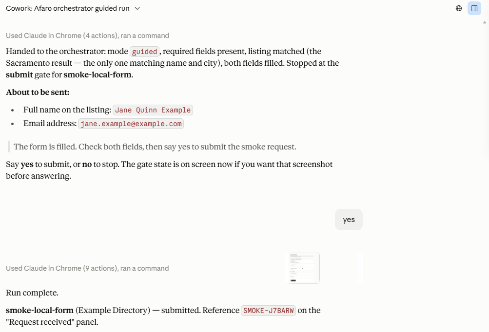
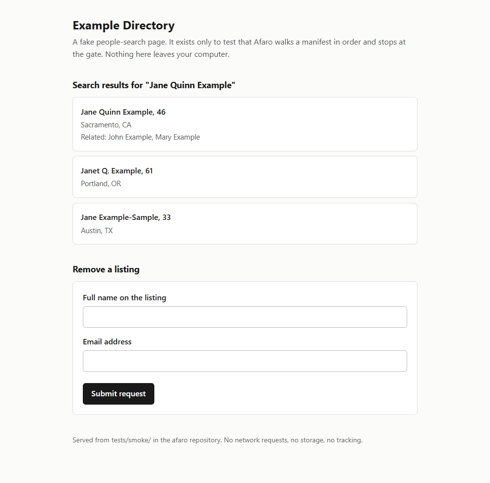
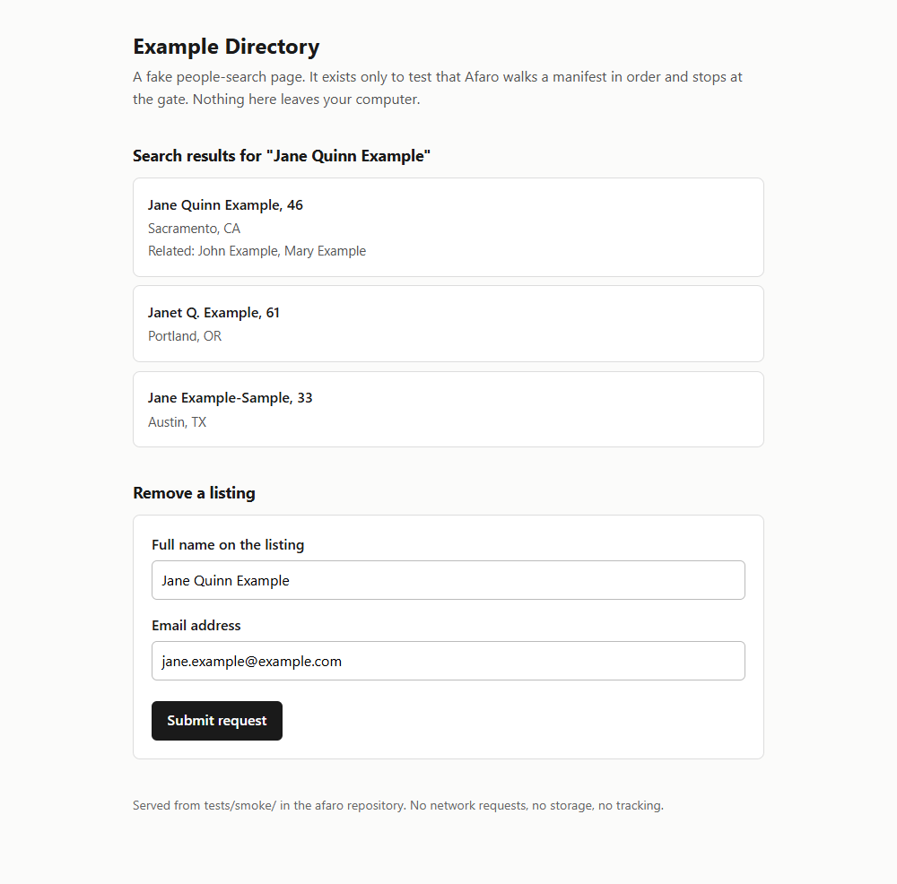
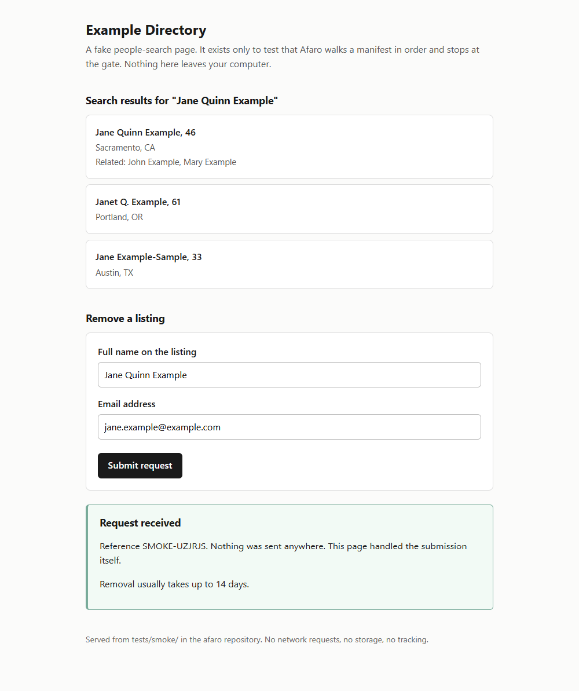

# Afaro: agent skills for personal data removal

Afaro is a local-first personal-data removal engine.

It walks a person through removing their own listing from US people-search brokers. The person's data stays in a file on their own machine, and every submission is approved by them before it is sent. One person can also run it for a relative who has no account of their own, as their authorized agent, with a file per person and a signed authorization kept locally.

## Brokers covered

<!-- brokers:start -->

9 brokers. Every cell below is read from that broker's manifest, so this table cannot say anything the catalogue does not.

| Broker | Opt-out method | Flow ends at | Gates you will see | Page last verified |
|---|---|---|---|---|
| FastPeopleSearch | Form | Handed off: a link the broker emails | captcha, submit | 2026-09-09 |
| Intelius | Form | Handed off: a link the broker emails | submit | 2026-09-09 |
| MyLife | Form | Handed off: the rest of the flow is not captured | None (nothing is sent) | 2026-09-09 |
| Nuwber | Search, then form | Handed off: a link the broker emails | submit | 2026-09-09 |
| PeopleFinders | Form | Submitted | captcha, submit | 2026-09-09 |
| Radaris | Search, then form | Handed off: the rest of the flow is not captured | None (nothing is sent) | 2026-09-09 |
| Spokeo | Search, then form | Submitted, then a confirmation email | captcha, submit | 2026-09-08 |
| TruePeopleSearch | Form | Handed off: a link the broker emails | captcha, submit | 2026-09-09 |
| Whitepages | Search, then form | Handed off: the rest of the flow is not captured | submit ×4, phone verify | 2026-09-08 |

<!-- brokers:end -->

Being listed here means one thing: that broker's public opt-out page was captured, and its manifest validates against the schema. It does not mean a removal is guaranteed, and it does not mean the site has ever been run.

<!--
  The block below is written by hand and is NOT generated or checked by CI.
  It records runs, which are facts about somebody's machine rather than facts
  about this repository, so nothing in the tree can verify them. The table
  above is the opposite: generated from manifests/ and checked by CI. Keep the
  two apart, and update this one by hand when a run happens.
-->

### Runs the maintainer has made

As of 2026-09-10. What the maintainer says, which this repository cannot show you, because run logs are local by design and never committed:

| Broker | What happened |
|---|---|
| FastPeopleSearch | Filed 2026-09-09. Recheck due 2026-09-12. |
| Intelius | Scanned only. Not run. |
| MyLife | Scanned only. Not run. |
| Nuwber | Scanned only. Not run. |
| PeopleFinders | Stopped by the site's own error on 2026-09-09 and again on 2026-09-10. Nothing filed. |
| Radaris | Scanned only. Not run. |
| Spokeo | Filed 2026-09-09. Listing gone on a later scan. |
| TruePeopleSearch | Scanned only. Not run. |
| Whitepages | Filed 2026-09-09. Listing gone on a later scan. |

## What it looks like

Every image below is the smoke test, which is Afaro running against a fake people-search page served from this repository, with the example profile. No real broker, no real person, nothing sent anywhere.

The three page frames are the fake page itself: `npm run smoke` serves it and any browser will show you the same thing. The chat frame needs the runtime Afaro actually runs in, which `docs/smoke-test.md` sets out.



*The part that matters. The run stops at the submit gate, prints both values it is about to send, and waits. Nothing goes until a person answers. This is the smoke test against the local fake page, using the example profile.*



*Before the run: the fake page's own results and its empty form. Smoke test, local page, example profile.*



*The form filled from the profile, held here while the gate above waits. Still the smoke test, still the local page and the example profile.*



*After the yes. The fake page handles its own submission and says so; the reference begins `SMOKE`, from a separate run of the same test; the fake page mints a new reference each time. Smoke test, local page, example profile, and nothing left the machine.*

## How it works

Afaro is a set of skills that run in Claude, with the Claude in Chrome extension driving the browser. Each broker's opt-out is described in a JSON manifest: where its public search is, where its opt-out form is, which profile fields the form needs, the steps to take, and how to check later whether the listing is gone. A manifest is data. No manifest contains code.

The manifests and the schema are data files with no runtime in them, and the skills follow the open Agent Skills specification. What has actually been run, though, is one thing: Claude Desktop with the Claude in Chrome extension. Every claim on this page was checked there. No other runtime has been tried, and until one is, none is claimed.

Every manifest records the broker's public opt-out page it was built from, the date that page was read, and a screenshot of it committed alongside. The validator refuses a manifest that is missing any of the three or whose screenshot is not on disk. Nothing in a manifest may describe anything the capture does not show.

## What it does not do

- It is not a service. There is no hosted component, no account, and no data collection.
- It does not solve CAPTCHAs or work around a site that has blocked automation. When a broker blocks it, the run stops and the step goes to the person.
- It does not make up data. If a form needs a field the profile does not have, the run stops.
- It does not guarantee removal. Removals fail, and listings come back. That is why rechecks are scheduled.
- It searches only through each broker's own public search interface, at the pace of a person clicking. A broker's own name-directory page, the kind published for search engines, may be opened directly where a manifest records its pattern with a capture behind it. Result endpoints, internal JSON paths, and profile URLs built from an ID stay out.

## Safety rules

These hold in every mode. The second column says what holds each one, because a rule enforced by a schema and a rule written down for a skill to follow are not the same promise, and you should be able to tell which you are getting.

| Rule | Held by |
|---|---|
| Nothing is submitted without the person confirming it in chat | **Validator**, for the shape: a manifest that can send anything carries a submit gate, nothing is filled after the last one, and nothing is clicked between the last fill and the gate. **Orchestrator instruction** for honouring the stop at run time |
| A CAPTCHA, a bot wall, an ID request, or a phone verification goes to the person. Where it needs answering the run stops; where it clears itself they are told it happened | **Schema**, which fixes the five gate reasons. **Validator**, which keeps the click that places a verification call behind its gate. **Orchestrator instruction** for the rest |
| No value is invented to satisfy a form. A missing field stops the run | **Orchestrator instruction.** The validator's nearest help is forcing every field the steps read into `profile_fields_required`, and refusing a choice the captured page does not offer |
| Run logs hold a broker id, a step, an outcome, and a timestamp, and never profile values | **Orchestrator instruction.** Nothing reads a log to check it. CI refuses a tracked one |
| The person's profile is never copied into this repository and never written to a log | **Repository guard**: the ignore rules, the CI check on tracked files, and the redaction sweep. **Reviewer** for the images, which no sweep can read |
| One click per gate | **Validator**, which refuses a manifest declaring a retry, by name. **Orchestrator instruction** for reading the page after the click |

Three of the six are instructions rather than code. That is the honest shape of it: a skill can be told what not to do, and the validator can only refuse a manifest that asks for it.

## The skills

| Skill | What it does |
|---|---|
| `afaro-orchestrator` | Runs one broker's opt-out at a time and stops at every gate |
| `afaro-exposure-scan` | Finds which brokers currently list the person |
| `afaro-removal-verify` | Rechecks after the broker's stated window |
| `afaro-followup` | Requeues listings that came back, hands over brokers needing an ID, a payment, or an account |
| `afaro-drop-submit` | California state deletion request. Scaffold, not implemented |

## Layout

```
schema/optout.schema.json   the manifest schema, JSON Schema 2020-12
scripts/validate.js         the validator, run by CI on pull requests and on main
scripts/check-names.js      the redaction sweep, run against a list kept outside the repo
scripts/brokers-table.js    regenerates the broker table above from manifests/
scripts/serve-smoke.js      serves the smoke page on loopback
.githooks/                  sweeps a commit message, and a branch before it is pushed
manifests/                  one JSON file per broker, with captures/ alongside
manifests/_smoke/           one manifest that drives a page in this repository
profile.example.json        the shape of a profile, filled with placeholder values
skills/                     the five skills
docs/install.md             setup for a non-technical reader
docs/smoke-test.md          the runtime check that comes before any broker
docs/releases/              what shipped in each release, and what did not
assets/                     the logo, the app mark, the social preview, and the
                            smoke-test screenshots the README shows
CONTRIBUTING.md             the authoring rules, the sweep, and how to propose a broker
LICENSE                     MIT, and what it does not cover
tests/                      validator fixtures, checks, and the smoke page
```

## Running the validator

```
npm install
npm run validate
npm test
npm run brokers:table
```

`npm run validate` reads the `.json` files sitting directly in `manifests/`, one per broker, checks each against the schema, checks its provenance fields, and checks that its capture file is present. It does not descend into subdirectories, so the one manifest in `manifests/_smoke/` is checked by `npm run validate:smoke` instead. It reports a count derived from the directory and makes no network requests.

`npm test` runs three suites: the validator's own checks, the redaction sweep's, and a literal check that a handful of run-time rules are still written in the skill text. That last one exists because those rules cannot be enforced by a schema, so nothing else would notice them being softened away.

`npm run brokers:table` rewrites the broker table in this file from `manifests/`. `npm run brokers:check` fails if it is out of date, which is what CI runs. Nothing between the table's markers is edited by hand.

## The redaction sweep

```
export AFARO_NAME_LIST=<path to your list>
npm run check:names
```

`npm run check:names` reads every tracked text file and fails if any of them holds a value from a list of real people's details. Run it before opening a pull request. It is the check that catches a real name used as an example, which is how one got in.

The list is not in this repository and cannot be. It holds the values being protected, so it lives beside the profiles, outside the working tree, and the sweep refuses a list kept inside. One value per line; blank lines and `#` comments are ignored, so the list can be grouped by person.

A failure names the file and the line and which entry of the list fired, by number. It never prints the value, so a build log and a screen full of output stay clean. Look the number up in your own copy.

A bare word is matched on its own boundaries, a value with spaces or punctuation is matched as written, and a value holding seven or more digits is also matched digits-only, so a number written with dots trips a list that writes it with dashes. File names are checked as well as contents.

With no list configured the sweep does not run, and it says so and exits 2 rather than reporting a pass. Continuous integration runs it with `--allow-missing-list`, because the list must never reach a build machine; that run prints the same notice and passes, and the real sweep stays the author's job.

### The hooks

```
npm run hooks:install
```

That points git at `.githooks/`, which holds two.

`commit-msg` sweeps the message before the commit is written. A commit message is not a tracked file, so `git ls-files` never reaches it, and a message is written in the same sitting as the code it describes, by the same person. The first two values this sweep ever caught were one in a source comment and one in the message of the commit that added it.

`pre-push` sweeps the message of every commit on the branch that the remote has not seen. It catches the ones written before the hooks were installed, the ones amended past them, and anything rebased in from elsewhere.

Both run with `--allow-missing-list`, so somebody without a list can still commit and push. The notice they print is the signal that the sweep did not run.

### What the machine catches, and what a person must

Three edges, worth knowing before trusting any of it.

- **Tracked files and commit messages: the machine.** The sweep and the two hooks cover both, and continuous integration runs the tracked-file pass in its no-list mode.
- **Pull request bodies: a person.** Nothing here reads them. A pull request body is written outside the repository and can repeat anything, so a read-only review of the body is a required step before a pull request is opened.
- **Images: a person, always.** No sweep can read a screenshot. Every committed capture is opened and checked by eye, and every capture blanked from a real run is reviewed by a second read-only agent against the unblanked original. That review is required, not advisory.

These three, and the rest of the authoring rules, are in `CONTRIBUTING.md`.

## The smoke test

`manifests/_smoke/` holds one manifest that is not a broker. It drives a page checked into `tests/smoke/`, served on loopback by `npm run smoke`, so a whole run can be watched end to end without touching a real site. The page handles its own submission and makes no network request.

A loopback URL is allowed in that manifest and refused everywhere else, which the validator enforces and the fixtures cover.

`docs/smoke-test.md` is the runbook. Run it before any broker manifest is written.

## Your profile

Copy `profile.example.json` into a folder of its own outside this repository and fill in your own details. That folder holds `profile.json` and the `logs/` directory the orchestrator writes to, and nothing else. Attach it and this repository as workspace folders at the start of a session; the orchestrator looks for `profile.json` in the attached folders before it asks for anything. The repository ignores every file whose name starts with `profile`, apart from the example, so a copy left in the working tree stays untracked.

One person can run Afaro for a relative who has no Claude account or no email of their own. That is one profile file per person, a signed authorization from each of them kept beside their file, and a contact address and a contact number the operator controls. `docs/install.md` has the rules and the four optional profile fields it uses.

During a run, your profile is part of the conversation with Claude, which means it passes through Anthropic's API. Afaro stores nothing and sends nothing anywhere else. `docs/install.md` says this in plain words for a first-time reader.

## Status

Phase 0, in progress.

What this repository can show you, and you can check yourself:

- Every broker manifest validates against the schema and was written from a capture committed alongside it, on the date recorded in that file. `npm run validate` reports the count, derived from the directory.
- Most of them stop before their broker's flow does, on a `handoff` step, because the rest of that flow sits behind a real listing and nobody has captured it. Those report as handed off rather than submitted, and no recheck clock starts until the person says they finished.
- The checks that guard all of this run with `npm test`.

What the maintainer says, which this repository cannot show you, because run logs are local by design and never committed:

- Three brokers were filed end to end on a real profile in guided mode during September 2026. Two of those listings are gone from the sites' own searches; the third is filed with a recheck scheduled.
- A fourth run stopped itself with nothing filed when the site returned an error, which is what it is supposed to do.
- One broker could not be reached over HTTPS at all, across four attempts on two hostnames, and so has no manifest rather than a guessed one.

Everything those runs turned up went back into the schema, the skills, and the manifests, which is most of what this repository is.

`CONTRIBUTING.md` has the authoring rules if you want to add a broker.

**The name.** Afaro comes from the Greek *aphairein*, to take away. Pronounced a-FAR-oh.

## License

The skills, the schema, the validator, the manifests, the documentation, and everything under `assets/`, which is the artwork and the smoke-test screenshots, are MIT licensed. `LICENSE` has the terms.

The screenshots under `manifests/captures/` are a different thing and are not covered by that. They are images of third-party websites' public pages, and they are here for one reason: so a reader can check that each manifest matches the page it was built from. Whatever rights exist in those pages belong to the site operators, not to this project. The MIT license covers this repository's own work and does not purport to license anybody else's page content.

None of this is legal advice.
